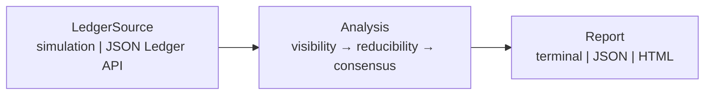

# canton-observer

Measure what your institution can actually prove on a privacy-preserving ledger.

> On a transparent chain, every node is an unbounded observer: global state is re-derivable by anyone. Canton deliberately breaks this — each validator holds data only for its hosted parties. Every institution on Canton is therefore a *bounded observer* of the network. Objective ledger reality does not exist by default; it emerges from the overlap of many partial views. `canton-observer` measures the boundary of one observer's view: what it can see, what it can prove locally, and what it must take on trust.

## The problem

Transparent-chain tooling assumes that anyone can replay global state. Canton makes privacy a protocol property: a party receives only contracts disclosed to it, so the public-node audit pattern does not apply.

BCBS 239 and ordinary substantiation work still require an institution to identify which reported figures it can support independently. On a partitioned ledger, that boundary is structural rather than a missing operational procedure.

Explorers describe visible activity. They do not calculate the boundary between locally derivable claims, counterparty-dependent claims, and referenced records outside one party's view. This read-only diagnostic does.

## What it computes

**Visibility horizon** inventories contracts visible to the subject, detects referenced-but-undisclosed records, and reports `visible / (visible + known unknowns)`.

**Reducibility classification** labels each configured claim `locally_derivable`, `trust_required`, or `invisible` from the role and dependencies of its inputs.

**Consensus distance** calculates Jaccard distance between party contract sets in simulation. A single live party cannot see another complete ACS, so live output can only be an explicitly labeled lower bound.

```text
╭──────────── Canton Observer ────────────╮
│ Bank A  [SIMULATION]                    │
╰─────────────────────────────────────────╯
Visibility coverage: 66.7%
repo-notional-a      locally_derivable
collateral-value-a   trust_required
downstream-use-a     invisible
Consensus distance to BankB: 0.333 (exact simulation)
```

## Conceptual grounding

The framing borrows one practical idea from bounded-observer research: useful shared reality is what observers with limited information can compute and reconcile. Here, the limit is the party-scoped Active Contract Set, not an analogy used to claim new physics.

| Bounded-observer concept | Canton analogue |
|---|---|
| Bounded observer | A party's validator and disclosed contracts |
| Computationally reducible pocket | State derivable from the party's ACS and model |
| Trust-required region | State depending on observer-only or counterparty inputs |
| Nearby observers agree | High disclosure overlap and low view divergence |

## Quickstart

```bash
python -m pip install -e ".[dev]"
canton-observer audit --scenario bilateral_repo --party BankA
canton-observer scenarios list
```

The default path uses bundled simulated ledger data and prints a yellow `SIMULATION` badge.

## Architecture



## Scope & limitations

This repository is simulation-first. The JSON Ledger API v2 adapter is experimental and has not been verified against LocalNet in this build. Live consensus distance is a lower bound because one party cannot retrieve a counterparty's undisclosed ACS. Payload reference detection is heuristic in live mode and can miss dependencies. The code contains no transaction submission, signing, wallet, Daml deployment, or ledger mutation path. Output is a diagnostic, not an audit opinion.

## Roadmap

- Daml model introspection for finer reducibility rules.
- Multi-party attested consensus distance.
- Participant Query Store backend.
- CIP-56-aware claim templates.

## Contributing

See [CONTRIBUTING.md](CONTRIBUTING.md). The easiest entries are a YAML scenario, a claim rule, or a report format; the seed backlog also includes syndicated lending, reserve attestation, and CSV output.

## Related work

CantonScan, Coin Metrics, and The Tie help answer “what happened” in the data available to them. `canton-observer` asks a different question: “what can this party prove happened?”

## Author

Built by [Vishnu Govind](https://github.com/vishnugovind10), Universal Ventures — tokenomics and institutional digital asset architecture. [Companion essays](https://vishnugovind10.medium.com/).

Code is MIT licensed. Documentation is CC BY 4.0.
