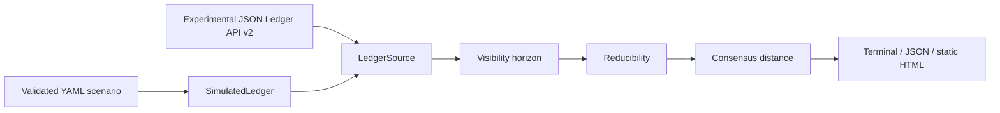

# Architecture

The source boundary is read-only. Analysis accepts validated models and has no transport dependency. Reporters consume one `ObserverReport`, keeping terminal, JSON, and HTML semantics aligned.
